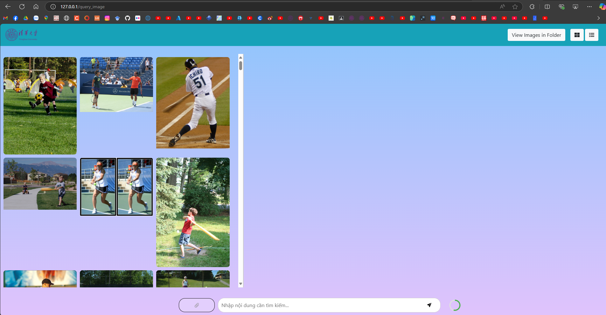
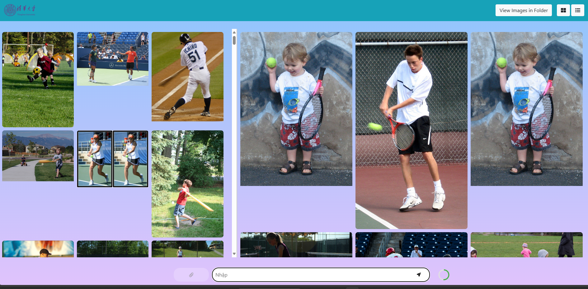
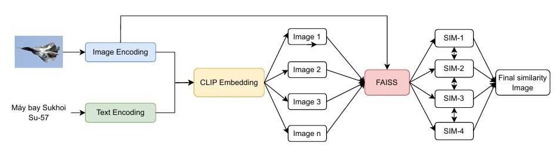

# End-to-End Image Retrieval with Vietnamese

[](https://www.python.org/downloads/release/python-3100/)
[](https://opensource.org/licenses/MIT)
[](https://www.docker.com/)

This repository contains the source code for the graduate project "End-to-End Image Retrieval with Vietnamese" from Hung Yen University of Technology and Education. The project focuses on building a system that can retrieve images from a dataset based on natural language descriptions in Vietnamese. It features a custom multi-modal model, inspired by the CLIP architecture, built from scratch and optimized for the Vietnamese language.

## 🌟 Overview

The system allows a user to input a descriptive sentence in Vietnamese (e.g., "a boy playing tennis") and returns the most relevant images from a given collection. The core challenge addressed is bridging the semantic gap between two distinct data modalities—text and images—within the context of Vietnamese, a language with unique linguistic challenges.

## 📸 Demo & Interface

The system is deployed as a simple and intuitive web application.

1.  **Select the target image directory for querying:**
    
    **Interface for selecting a folder**

2.  **Enter a Vietnamese text query and receive the results:**
    *Query: "A boy playing tennis"*
    
    **Query results for "A boy playing tennis"**


## ✨ Key Features

-   **Vietnamese Text-to-Image Search:** Accurately retrieve images using semantic Vietnamese text descriptions.
-   **Custom CLIP-like Model:** A multi-modal model built from scratch in PyTorch, not dependent on pre-trained English models, to better capture Vietnamese semantics.
-   **Optimized Encoders:** Systematically experimented and selected the best-performing encoders for images (**Swin Transformer**) and text (**phoBERT**).
-   **High-Performance Retrieval:** Integrated **FAISS** (Facebook AI Similarity Search) to accelerate similarity search on a large scale, ensuring fast response times.
-   **End-to-End Application:** A complete, deployable solution from data processing and model training to a web interface (Flask) and containerization (Docker).

## 🏗️ Model Architecture

The project employs a proposed multi-modal architecture that combines state-of-the-art components for maximum effectiveness.



The pipeline works as follows:
1.  **Image Encoder (Swin Transformer):** Encodes images into high-dimensional feature vectors.
2.  **Text Encoder (phoBERT):** Encodes Vietnamese text descriptions into corresponding feature vectors.
3.  **Projection Head:** Maps the vectors from both encoders into a shared embedding space where their similarity can be measured.
4.  **Contrastive Learning:** The model is trained to maximize the cosine similarity between correct (image, caption) pairs and minimize it for incorrect pairs.
5.  **FAISS Index:** All image vectors from the dataset are indexed by FAISS. During inference, this allows for ultra-fast K-Nearest Neighbors (KNN) search to find the best matches for a new text query.

## 📊 Performance & Evaluation

The model was rigorously evaluated on the **UIT-ViLC** and **UIT-EVJVQA** datasets.

#### 1. Image Encoder Selection
The Swin Transformer demonstrated superior performance over other architectures on the combined dataset.

| Model              | Top1 Acc | Top5 Acc | R@5     | mAP     | **Avg.** |
| :----------------- | :------- | :------- | :------ | :------ | :------- |
| **Swin-Transformer** | **7.27%**  | **36.22%** | **36.24%**| **30.63** | **34.25**  |
| ConvNextV2         | 6.02%    | 33.08%   | 33.02%  | 28.21   | 33.01    |

#### 2. Text Encoder Selection
The `phoBERT-large` model provided a significant boost in performance compared to the `base` version.

| Model             | Top1 Acc | R@5     | mAP     | **Avg.** |
| :---------------- | :------- | :------ | :------ | :------- |
| **phoBERT-large** | **7.99%**  | **39.86%**| **33.69** | **37.68**  |
| phoBERT-base      | 7.27%    | 36.24%  | 30.63   | 34.25    |

#### 3. FAISS Search Method Evaluation
The **KNN (Flat L2)** method yielded the highest accuracy on the DISC21 benchmark dataset.

| FAISS Method      | Top1 Acc | Top30 Acc | mAP@5  | **Avg.** |
| :---------------- | :------- | :-------- | :----- | :------- |
| **KNN**           | **14.9%**  | **70.0%**   | **0.68** | **58.1**   |
| Proximity Graph   | 13.2%    | 68.4%     | 0.62   | 52.3     |
| K-means           | 12.1%    | 66.2%     | 0.61   | 50.8     |

## 💻 Tech Stack

-   **AI Framework:** PyTorch
-   **Models & Libraries:** Hugging Face Transformers, Timm (PyTorch Image Models)
-   **Vector Search:** FAISS
-   **Backend & API:** Flask
-   **Deployment:** Docker

## 🚀 Getting Started

You can run this project using Docker (recommended for ease of use) or by setting up the environment manually.

### 1. Using Docker (Recommended)

This is the simplest way to get the application running without environment conflicts.

**Prerequisites:** [Docker](https://www.docker.com/get-started) must be installed.

1.  **Clone the repository:**
    ```bash
    git clone https://github.com/your-username/your-repo-name.git
    cd your-repo-name
    ```

2.  **Build the Docker image:**
    This command will automatically install all dependencies defined in the `Dockerfile`.
    ```bash
    docker build -t vietnamese-image-retrieval .
    ```

3.  **Run the Docker container:**
    This will start the web application on port 7860.
    ```bash
    docker run -p 7860:7860 vietnamese-image-retrieval
    ```

4.  Open your browser and navigate to `http://localhost:7860`.

### 2. Manual Installation

**Prerequisites:** [Python 3.10+](https://www.python.org/) and `pip`.

1.  **Clone the repository:**
    ```bash
    git clone https://github.com/your-username/your-repo-name.git
    cd your-repo-name
    ```

2.  **Create and activate a virtual environment:**
    ```bash
    # Create the environment
    python -m venv venv
    
    # On Windows
    venv\Scripts\activate
    
    # On macOS/Linux
    source venv/bin/activate
    ```

3.  **Install the required libraries:**
    ```bash
    pip install -r requirements.txt
    ```

4.  **Download Datasets and Model Weights:**
    *Note: You will need to download the pre-trained model weights and datasets. Place them in the appropriate directories (e.g., `models/`, `data/`) as configured in the project's config file.*

5.  **Run the application:**
    ```bash
    python setup.py 
    ```

6.  Open your browser and navigate to `http://localhost:7860`.

## 🛠️ Future Work

-   **Model Performance Enhancement:** Further fine-tune hyperparameters and experiment with more advanced loss functions.
-   **Dataset Expansion:** Collect more Vietnamese image-caption pairs to improve the model's generalization and accuracy.
-   **API and UI Optimization:** Improve the API's response latency and enhance the user experience on the web interface.

## 🙏 Acknowledgements

-   Sincere thanks to **Hung Yen University of Technology and Education** for providing the opportunity to conduct this research.
-   Special thanks to my supervisor, **Dr. Trung-Hieu Le**, for his dedicated guidance and support throughout the project.
-   Credit to the NLP group at the **University of Science, VNU-HCMC**, for creating and sharing the valuable UIT-ViLC and EVJVQA datasets.

## 📄 License

This project is licensed under the [MIT License](LICENSE).
